# Diagrammes de l'API

Diagrammes Mermaid pour comprendre l'architecture et le fonctionnement de l'API.

## Table des matières

- [Architecture globale](#architecture-globale)
- [Pipeline de données](#pipeline-de-données)
- [Modèle de données](#modèle-de-données)
- [Structure des routes API](#structure-des-routes-api)
- [Flux d'une requête](#flux-dune-requête)
- [Résolution de la chaîne de propriété](#résolution-de-la-chaîne-de-propriété)

---

## Architecture globale

Vue d'ensemble de l'architecture du projet.

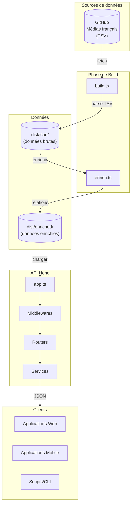

---

## Pipeline de données

Transformation des données depuis les fichiers TSV source jusqu'aux données enrichies.

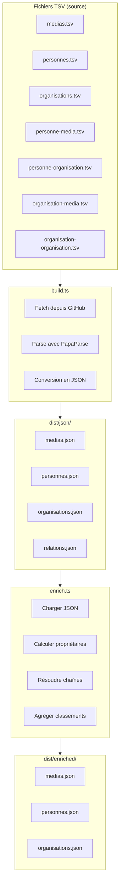

---

## Modèle de données

Relations entre les entités principales.

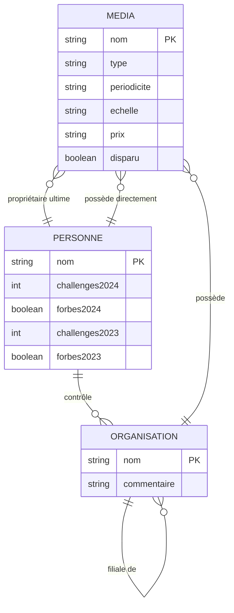

### Structure des données enrichies

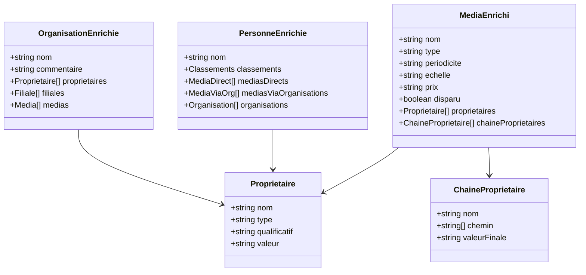

---

## Structure des routes API

Organisation hiérarchique des endpoints.

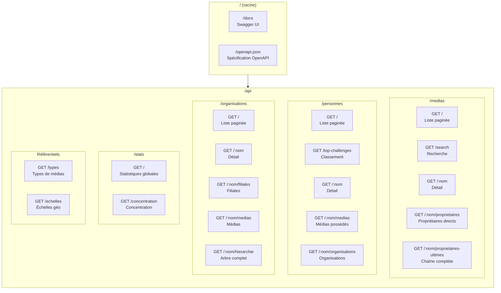

### Détail des routes par ressource

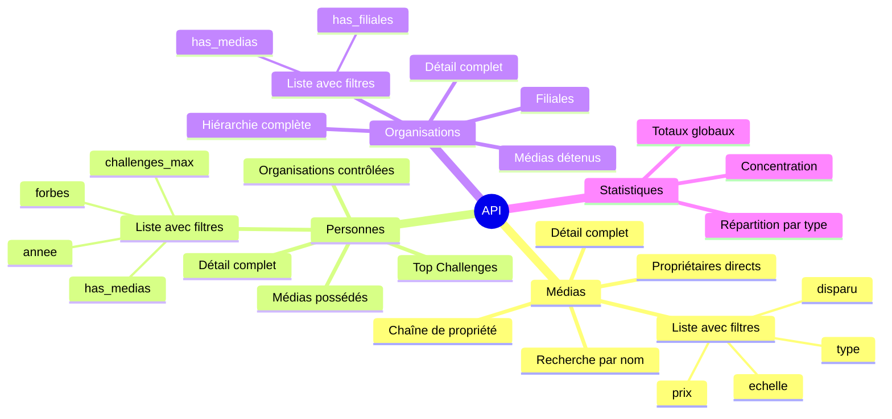

---

## Flux d'une requête

Parcours d'une requête HTTP à travers l'application.

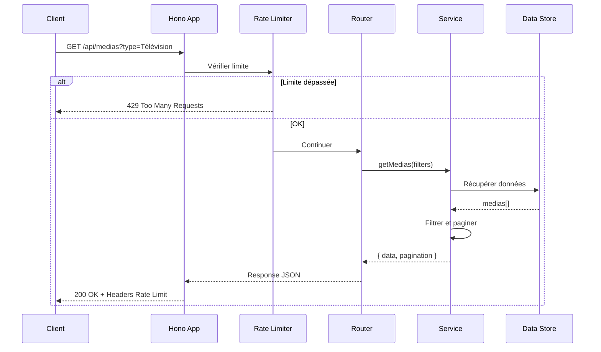

### Flux avec gestion d'erreur

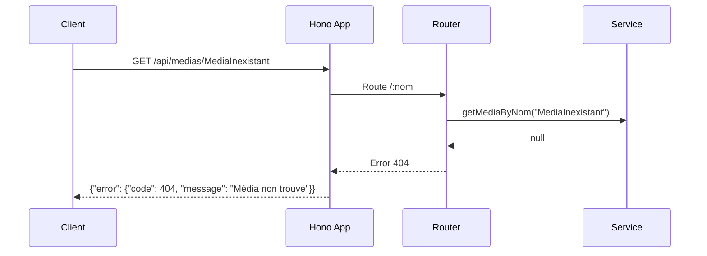

---

## Résolution de la chaîne de propriété

Algorithme de calcul des propriétaires ultimes d'un média.

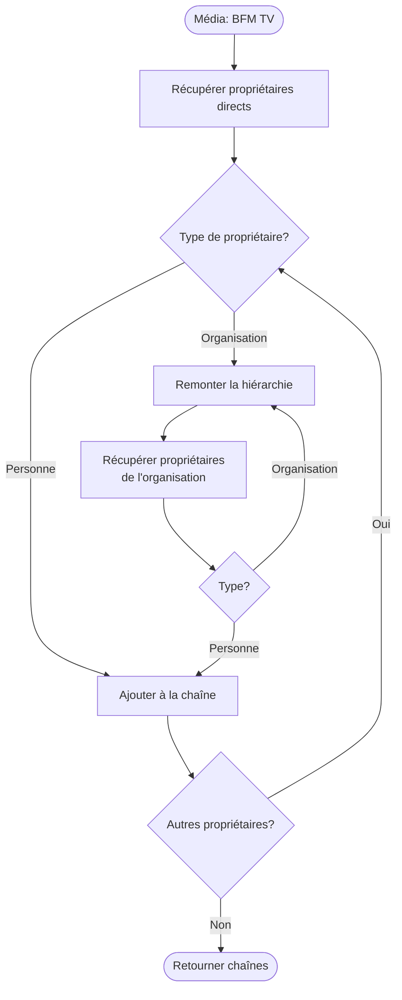

### Exemple concret

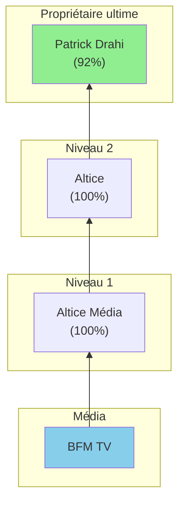

### Cas avec plusieurs propriétaires

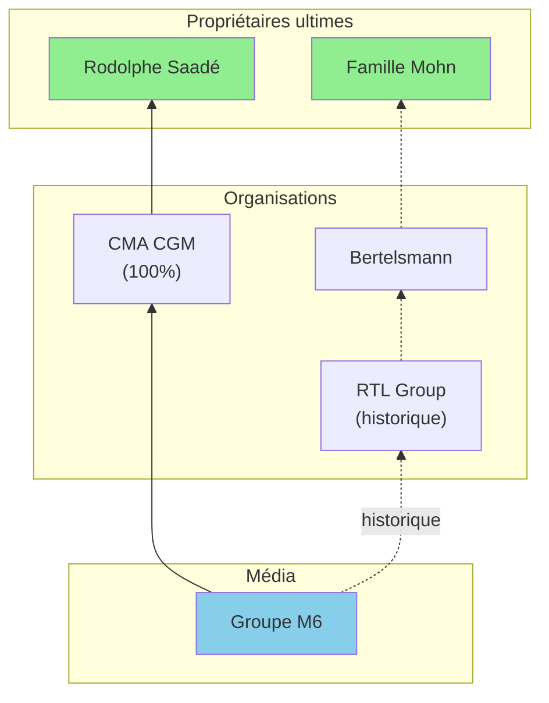

---

## Déploiement

Architecture de déploiement sur Deno Deploy.

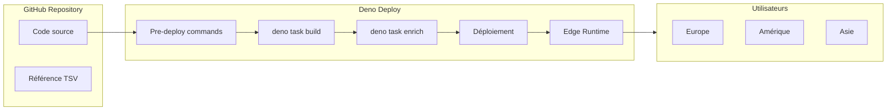

---

## Middlewares

Chaîne de middlewares appliqués à chaque requête.

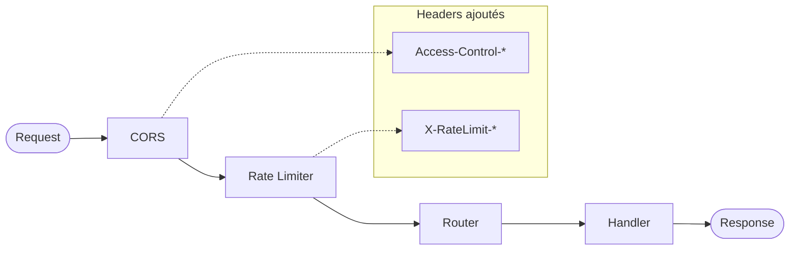

---

## Tests

Structure des tests du projet.

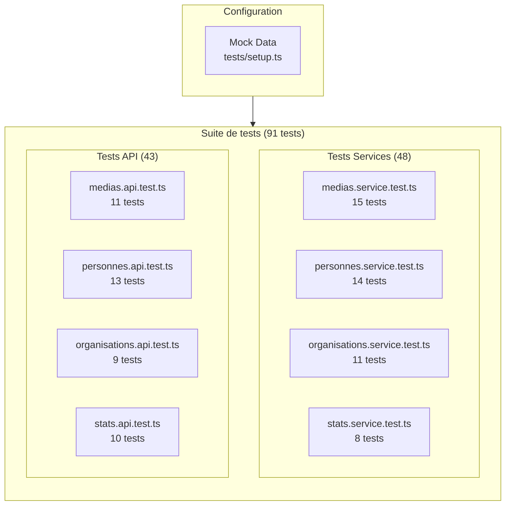
