# Diagrammes de l'API

Diagrammes Mermaid pour comprendre l'architecture et le fonctionnement de l'API.

## Table des matières

- [Architecture globale](#architecture-globale)
- [Pipeline de données](#pipeline-de-données)
- [Modèle de données](#modèle-de-données)
- [Structure des routes API](#structure-des-routes-api)
- [Flux d'une requête](#flux-dune-requête)
- [Résolution de la chaîne de propriété](#résolution-de-la-chaîne-de-propriété)

---

## Architecture globale

Vue d'ensemble de l'architecture du projet.

```mermaid
flowchart TB
    subgraph Sources["🗄️ Sources de données"]
        GH[("GitHub<br/>Médias français<br/>(TSV)")]
    end

    subgraph Build["⚙️ Phase de Build"]
        B1[build.ts]
        B2[enrich.ts]
    end

    subgraph Data["💾 Données"]
        JSON1[("dist/json/<br/>(données brutes)")]
        JSON2[("dist/enriched/<br/>(données enrichies)")]
    end

    subgraph API["🚀 API Hono"]
        APP[app.ts]
        MW[Middlewares]
        RT[Routers]
        SV[Services]
    end

    subgraph Clients["👥 Clients"]
        WEB[Applications Web]
        MOB[Applications Mobile]
        CLI[Scripts/CLI]
    end

    GH -->|fetch| B1
    B1 -->|parse TSV| JSON1
    JSON1 -->|enrichir| B2
    B2 -->|relations| JSON2
    JSON2 -->|charger| APP
    APP --> MW
    MW --> RT
    RT --> SV
    SV -->|JSON| Clients

    style GH fill:#6366f1,stroke:#4f46e5,color:#fff
    style B1 fill:#f59e0b,stroke:#d97706,color:#fff
    style B2 fill:#f59e0b,stroke:#d97706,color:#fff
    style JSON1 fill:#8b5cf6,stroke:#7c3aed,color:#fff
    style JSON2 fill:#10b981,stroke:#059669,color:#fff
    style APP fill:#06b6d4,stroke:#0891b2,color:#fff
    style MW fill:#06b6d4,stroke:#0891b2,color:#fff
    style RT fill:#06b6d4,stroke:#0891b2,color:#fff
    style SV fill:#06b6d4,stroke:#0891b2,color:#fff
    style WEB fill:#ec4899,stroke:#db2777,color:#fff
    style MOB fill:#ec4899,stroke:#db2777,color:#fff
    style CLI fill:#ec4899,stroke:#db2777,color:#fff
```

---

## Pipeline de données

Transformation des données depuis les fichiers TSV source jusqu'aux données enrichies.

```mermaid
flowchart TB
    subgraph TSV["📄 Fichiers TSV (source)"]
        direction LR
        T1[medias.tsv]
        T2[personnes.tsv]
        T3[organisations.tsv]
        T4[personne-media.tsv]
        T5[personne-organisation.tsv]
        T6[organisation-media.tsv]
        T7[organisation-organisation.tsv]
    end

    subgraph Build["⚙️ build.ts"]
        direction LR
        F1[Fetch depuis GitHub]
        F2[Parse avec PapaParse]
        F3[Conversion en JSON]
    end

    subgraph JSON["📦 dist/json/"]
        direction LR
        J1[medias.json]
        J2[personnes.json]
        J3[organisations.json]
        J4[relations.json]
    end

    subgraph Enrich["✨ enrich.ts"]
        direction LR
        E1[Charger JSON]
        E2[Calculer propriétaires]
        E3[Résoudre chaînes]
        E4[Agréger classements]
    end

    subgraph Enriched["🎯 dist/enriched/"]
        direction LR
        R1[medias.json]
        R2[personnes.json]
        R3[organisations.json]
    end

    TSV --> Build
    Build --> JSON
    JSON --> Enrich
    Enrich --> Enriched

    style T1 fill:#6366f1,stroke:#4f46e5,color:#fff
    style T2 fill:#6366f1,stroke:#4f46e5,color:#fff
    style T3 fill:#6366f1,stroke:#4f46e5,color:#fff
    style T4 fill:#818cf8,stroke:#6366f1,color:#fff
    style T5 fill:#818cf8,stroke:#6366f1,color:#fff
    style T6 fill:#818cf8,stroke:#6366f1,color:#fff
    style T7 fill:#818cf8,stroke:#6366f1,color:#fff
    style F1 fill:#f59e0b,stroke:#d97706,color:#fff
    style F2 fill:#f59e0b,stroke:#d97706,color:#fff
    style F3 fill:#f59e0b,stroke:#d97706,color:#fff
    style J1 fill:#8b5cf6,stroke:#7c3aed,color:#fff
    style J2 fill:#8b5cf6,stroke:#7c3aed,color:#fff
    style J3 fill:#8b5cf6,stroke:#7c3aed,color:#fff
    style J4 fill:#8b5cf6,stroke:#7c3aed,color:#fff
    style E1 fill:#14b8a6,stroke:#0d9488,color:#fff
    style E2 fill:#14b8a6,stroke:#0d9488,color:#fff
    style E3 fill:#14b8a6,stroke:#0d9488,color:#fff
    style E4 fill:#14b8a6,stroke:#0d9488,color:#fff
    style R1 fill:#10b981,stroke:#059669,color:#fff
    style R2 fill:#10b981,stroke:#059669,color:#fff
    style R3 fill:#10b981,stroke:#059669,color:#fff
```

---

## Modèle de données

Relations entre les entités principales.

```mermaid
erDiagram
    MEDIA {
        string nom PK
        string type
        string periodicite
        string echelle
        string prix
        boolean disparu
    }

    PERSONNE {
        string nom PK
        int challenges2024
        boolean forbes2024
        int challenges2023
        boolean forbes2023
    }

    ORGANISATION {
        string nom PK
        string commentaire
    }

    PERSONNE ||--o{ MEDIA : "possède directement"
    PERSONNE ||--o{ ORGANISATION : "contrôle"
    ORGANISATION ||--o{ MEDIA : "possède"
    ORGANISATION ||--o{ ORGANISATION : "filiale de"

    MEDIA }o--|| PERSONNE : "propriétaire ultime"
```

### Structure des données enrichies

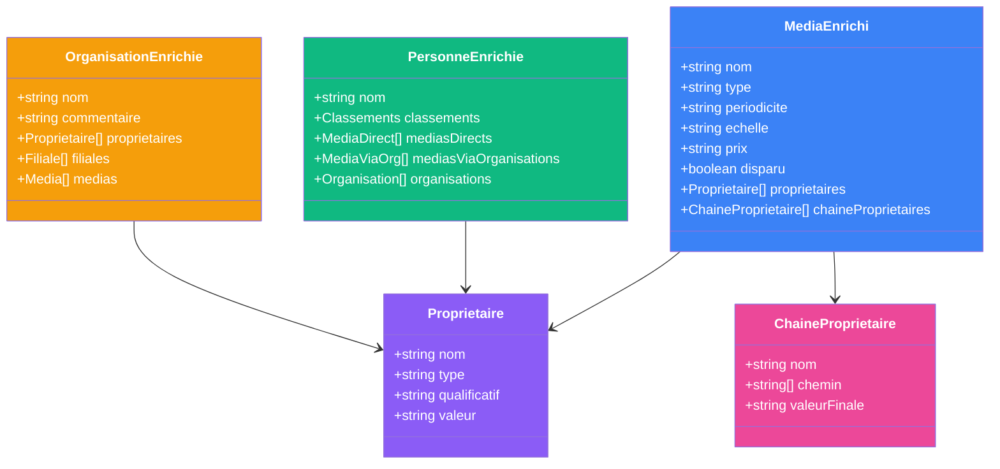

---

## Structure des routes API

Organisation hiérarchique des endpoints.

```mermaid
flowchart TB
    subgraph Root["🌐 / (racine)"]
        DOCS["/docs<br/>Swagger UI"]
        SPEC["/openapi.json<br/>Spécification OpenAPI"]
    end

    subgraph API["📡 /api"]
        direction TB

        subgraph Medias["📺 /medias"]
            M1["GET /<br/>Liste paginée"]
            M2["GET /search<br/>Recherche"]
            M3["GET /:nom<br/>Détail"]
            M4["GET /:nom/proprietaires<br/>Propriétaires directs"]
            M5["GET /:nom/proprietaires-ultimes<br/>Chaîne complète"]
        end

        subgraph Personnes["👤 /personnes"]
            P1["GET /<br/>Liste paginée"]
            P2["GET /top-challenges<br/>Classement"]
            P3["GET /:nom<br/>Détail"]
            P4["GET /:nom/medias<br/>Médias possédés"]
            P5["GET /:nom/organisations<br/>Organisations"]
        end

        subgraph Organisations["🏢 /organisations"]
            O1["GET /<br/>Liste paginée"]
            O2["GET /:nom<br/>Détail"]
            O3["GET /:nom/filiales<br/>Filiales"]
            O4["GET /:nom/medias<br/>Médias"]
            O5["GET /:nom/hierarchie<br/>Arbre complet"]
        end

        subgraph Stats["📊 /stats"]
            S1["GET /<br/>Statistiques globales"]
            S2["GET /concentration<br/>Concentration"]
        end

        subgraph Refs["📚 Référentiels"]
            R1["GET /types<br/>Types de médias"]
            R2["GET /echelles<br/>Échelles géo"]
        end
    end

    Root --> API

    style DOCS fill:#6366f1,stroke:#4f46e5,color:#fff
    style SPEC fill:#6366f1,stroke:#4f46e5,color:#fff
    style M1 fill:#3b82f6,stroke:#2563eb,color:#fff
    style M2 fill:#3b82f6,stroke:#2563eb,color:#fff
    style M3 fill:#3b82f6,stroke:#2563eb,color:#fff
    style M4 fill:#3b82f6,stroke:#2563eb,color:#fff
    style M5 fill:#3b82f6,stroke:#2563eb,color:#fff
    style P1 fill:#10b981,stroke:#059669,color:#fff
    style P2 fill:#10b981,stroke:#059669,color:#fff
    style P3 fill:#10b981,stroke:#059669,color:#fff
    style P4 fill:#10b981,stroke:#059669,color:#fff
    style P5 fill:#10b981,stroke:#059669,color:#fff
    style O1 fill:#f59e0b,stroke:#d97706,color:#fff
    style O2 fill:#f59e0b,stroke:#d97706,color:#fff
    style O3 fill:#f59e0b,stroke:#d97706,color:#fff
    style O4 fill:#f59e0b,stroke:#d97706,color:#fff
    style O5 fill:#f59e0b,stroke:#d97706,color:#fff
    style S1 fill:#8b5cf6,stroke:#7c3aed,color:#fff
    style S2 fill:#8b5cf6,stroke:#7c3aed,color:#fff
    style R1 fill:#ec4899,stroke:#db2777,color:#fff
    style R2 fill:#ec4899,stroke:#db2777,color:#fff
```

### Détail des routes par ressource

```mermaid
%%{init: {'theme': 'base', 'themeVariables': { 'primaryColor': '#bfdbfe', 'secondaryColor': '#a7f3d0', 'tertiaryColor': '#fde68a', 'primaryTextColor': '#000000', 'secondaryTextColor': '#000000', 'tertiaryTextColor': '#000000', 'lineColor': '#6b7280'}}}%%
mindmap
  root((🌐 API))
    📺 Médias
      Liste avec filtres
        type
        prix
        echelle
        disparu
      Recherche par nom
      Détail complet
      Propriétaires directs
      Chaîne de propriété
    👤 Personnes
      Liste avec filtres
        forbes
        challenges_max
        annee
        has_medias
      Top Challenges
      Détail complet
      Médias possédés
      Organisations contrôlées
    🏢 Organisations
      Liste avec filtres
        has_medias
        has_filiales
      Détail complet
      Filiales
      Médias détenus
      Hiérarchie complète
    📊 Statistiques
      Totaux globaux
      Répartition par type
      Concentration
```

---

## Flux d'une requête

Parcours d'une requête HTTP à travers l'application.

```mermaid
sequenceDiagram
    participant C as 👤 Client
    participant H as 🚀 Hono App
    participant RL as 🛡️ Rate Limiter
    participant R as 🔀 Router
    participant S as ⚙️ Service
    participant D as 💾 Data Store

    C->>H: GET /api/medias?type=Télévision
    H->>RL: Vérifier limite

    alt Limite dépassée
        RL-->>C: 429 Too Many Requests
    else OK
        RL->>R: Continuer
        R->>S: getMedias(filters)
        S->>D: Récupérer données
        D-->>S: medias[]
        S->>S: Filtrer et paginer
        S-->>R: { data, pagination }
        R-->>H: Response JSON
        H-->>C: 200 OK + Headers Rate Limit
    end
```

### Flux avec gestion d'erreur

```mermaid
sequenceDiagram
    participant C as 👤 Client
    participant H as 🚀 Hono App
    participant R as 🔀 Router
    participant S as ⚙️ Service

    C->>H: GET /api/medias/MediaInexistant
    H->>R: Route /:nom
    R->>S: getMediaByNom("MediaInexistant")
    S-->>R: null
    R-->>H: Error 404
    H-->>C: {"error": {"code": 404, "message": "Média non trouvé"}}
```

---

## Résolution de la chaîne de propriété

Algorithme de calcul des propriétaires ultimes d'un média.

```mermaid
flowchart TD
    START([🎬 Média: BFM TV]) --> PROP[Récupérer propriétaires directs]
    PROP --> CHECK{Type de propriétaire?}

    CHECK -->|Personne| FOUND[✅ Ajouter à la chaîne]
    CHECK -->|Organisation| ORG[🔄 Remonter la hiérarchie]

    ORG --> PARENT[Récupérer propriétaires<br/>de l'organisation]
    PARENT --> CHECK2{Type?}

    CHECK2 -->|Personne| FOUND
    CHECK2 -->|Organisation| ORG

    FOUND --> MORE{Autres propriétaires?}
    MORE -->|Oui| CHECK
    MORE -->|Non| END([📋 Retourner chaînes])

    style START fill:#3b82f6,stroke:#2563eb,color:#fff
    style PROP fill:#8b5cf6,stroke:#7c3aed,color:#fff
    style CHECK fill:#f59e0b,stroke:#d97706,color:#fff
    style FOUND fill:#10b981,stroke:#059669,color:#fff
    style ORG fill:#06b6d4,stroke:#0891b2,color:#fff
    style PARENT fill:#8b5cf6,stroke:#7c3aed,color:#fff
    style CHECK2 fill:#f59e0b,stroke:#d97706,color:#fff
    style MORE fill:#f59e0b,stroke:#d97706,color:#fff
    style END fill:#10b981,stroke:#059669,color:#fff
```

### Exemple concret

```mermaid
flowchart BT
    subgraph Media["📺 Média"]
        BFM["BFM TV"]
    end

    subgraph Niveau1["🏢 Niveau 1"]
        AM["Altice Média<br/>(100%)"]
    end

    subgraph Niveau2["🏢 Niveau 2"]
        ALT["Altice<br/>(100%)"]
    end

    subgraph Niveau3["👤 Propriétaire ultime"]
        PD["Patrick Drahi<br/>(92%)"]
    end

    BFM --> AM
    AM --> ALT
    ALT --> PD

    style BFM fill:#3b82f6,stroke:#2563eb,color:#fff
    style AM fill:#f59e0b,stroke:#d97706,color:#fff
    style ALT fill:#f59e0b,stroke:#d97706,color:#fff
    style PD fill:#10b981,stroke:#059669,color:#fff
```

### Cas avec plusieurs propriétaires

```mermaid
flowchart BT
    subgraph Media["📺 Média"]
        M6["Groupe M6"]
    end

    subgraph Orgs["🏢 Organisations"]
        CMA["CMA CGM<br/>(100%)"]
        RTL["RTL Group<br/>(historique)"]
        BERT["Bertelsmann"]
    end

    subgraph Personnes["👤 Propriétaires ultimes"]
        RS["Rodolphe Saadé"]
        FM["Famille Mohn"]
    end

    M6 --> CMA
    M6 -.->|historique| RTL
    RTL -.-> BERT
    CMA --> RS
    BERT -.-> FM

    style M6 fill:#3b82f6,stroke:#2563eb,color:#fff
    style CMA fill:#f59e0b,stroke:#d97706,color:#fff
    style RTL fill:#9ca3af,stroke:#6b7280,color:#fff
    style BERT fill:#9ca3af,stroke:#6b7280,color:#fff
    style RS fill:#10b981,stroke:#059669,color:#fff
    style FM fill:#10b981,stroke:#059669,color:#fff
```

---

## Déploiement

Architecture de déploiement sur Deno Deploy.

```mermaid
flowchart LR
    subgraph GitHub["🐙 GitHub Repository"]
        CODE[Code source]
        TSV[Référence TSV]
    end

    subgraph DenoD["🦕 Deno Deploy"]
        direction TB
        PRE[Pre-deploy commands]
        BUILD[deno task build]
        ENRICH[deno task enrich]
        DEPLOY[Déploiement]
        EDGE[Edge Runtime]
    end

    subgraph Users["🌍 Utilisateurs"]
        EU[Europe]
        US[Amérique]
        AS[Asie]
    end

    CODE --> PRE
    PRE --> BUILD
    BUILD --> ENRICH
    ENRICH --> DEPLOY
    DEPLOY --> EDGE
    EDGE --> Users

    style CODE fill:#6366f1,stroke:#4f46e5,color:#fff
    style TSV fill:#6366f1,stroke:#4f46e5,color:#fff
    style PRE fill:#f59e0b,stroke:#d97706,color:#fff
    style BUILD fill:#f59e0b,stroke:#d97706,color:#fff
    style ENRICH fill:#f59e0b,stroke:#d97706,color:#fff
    style DEPLOY fill:#10b981,stroke:#059669,color:#fff
    style EDGE fill:#06b6d4,stroke:#0891b2,color:#fff
    style EU fill:#ec4899,stroke:#db2777,color:#fff
    style US fill:#ec4899,stroke:#db2777,color:#fff
    style AS fill:#ec4899,stroke:#db2777,color:#fff
```

---

## Middlewares

Chaîne de middlewares appliqués à chaque requête.

```mermaid
flowchart LR
    REQ([🌐 Request]) --> CORS
    CORS[🔓 CORS] --> RL[🛡️ Rate Limiter]
    RL --> ROUTE[🔀 Router]
    ROUTE --> HANDLER[⚙️ Handler]
    HANDLER --> RES([✅ Response])

    subgraph Headers["📋 Headers ajoutés"]
        H1[Access-Control-*]
        H2[X-RateLimit-*]
    end

    CORS -.-> H1
    RL -.-> H2

    style REQ fill:#6366f1,stroke:#4f46e5,color:#fff
    style CORS fill:#f59e0b,stroke:#d97706,color:#fff
    style RL fill:#ef4444,stroke:#dc2626,color:#fff
    style ROUTE fill:#8b5cf6,stroke:#7c3aed,color:#fff
    style HANDLER fill:#06b6d4,stroke:#0891b2,color:#fff
    style RES fill:#10b981,stroke:#059669,color:#fff
    style H1 fill:#fbbf24,stroke:#f59e0b,color:#000
    style H2 fill:#fbbf24,stroke:#f59e0b,color:#000
```

---

## Tests

Structure des tests du projet.

```mermaid
flowchart TB
    subgraph Tests["🧪 Suite de tests (91 tests)"]
        direction TB

        subgraph Services["⚙️ Tests Services (48)"]
            TS1[medias.service.test.ts<br/>15 tests]
            TS2[personnes.service.test.ts<br/>14 tests]
            TS3[organisations.service.test.ts<br/>11 tests]
            TS4[stats.service.test.ts<br/>8 tests]
        end

        subgraph API["📡 Tests API (43)"]
            TA1[medias.api.test.ts<br/>11 tests]
            TA2[personnes.api.test.ts<br/>13 tests]
            TA3[organisations.api.test.ts<br/>9 tests]
            TA4[stats.api.test.ts<br/>10 tests]
        end
    end

    subgraph Setup["🔧 Configuration"]
        MOCK[Mock Data<br/>tests/setup.ts]
    end

    Setup --> Tests

    style TS1 fill:#8b5cf6,stroke:#7c3aed,color:#fff
    style TS2 fill:#8b5cf6,stroke:#7c3aed,color:#fff
    style TS3 fill:#8b5cf6,stroke:#7c3aed,color:#fff
    style TS4 fill:#8b5cf6,stroke:#7c3aed,color:#fff
    style TA1 fill:#3b82f6,stroke:#2563eb,color:#fff
    style TA2 fill:#3b82f6,stroke:#2563eb,color:#fff
    style TA3 fill:#3b82f6,stroke:#2563eb,color:#fff
    style TA4 fill:#3b82f6,stroke:#2563eb,color:#fff
    style MOCK fill:#10b981,stroke:#059669,color:#fff
```
